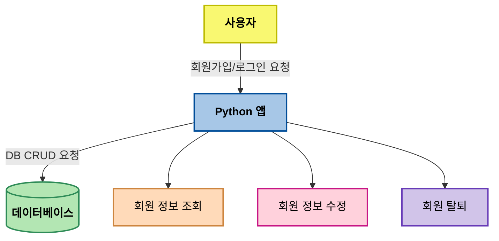

<!-- 너는 파이썬 개발자야. 간단한 회원 관리 프로그램을 개발한건데, 프로그램 구조도를 Mermaid 로 그려줘. 예를들어, 파이썬 앱, 데이터베이스 등 -->

```mermaid
graph TD
    A[사용자] -->|회원가입/로그인 요청| B[Python 앱]
    B -->|DB CRUD 요청| C[(데이터베이스)]
    
    B --> D[회원 정보 조회]
    B --> E[회원 정보 수정]
    B --> F[회원 탈퇴]

%% 노드 스타일 정의
    style A fill:#f9f871,stroke:#bdbb00,stroke-width:2px,color:#000,font-weight:bold
    style B fill:#a7c7e7,stroke:#004d99,stroke-width:2px,color:#000,font-weight:bold
    style C fill:#b3e6b3,stroke:#2e8b57,stroke-width:2px,color:#000,font-weight:bold
    style D fill:#ffdab9,stroke:#cd853f,stroke-width:2px,color:#000
    style E fill:#ffd1dc,stroke:#c71585,stroke-width:2px,color:#000
    style F fill:#d1c4e9,stroke:#673ab7,stroke-width:2px,color:#000
```